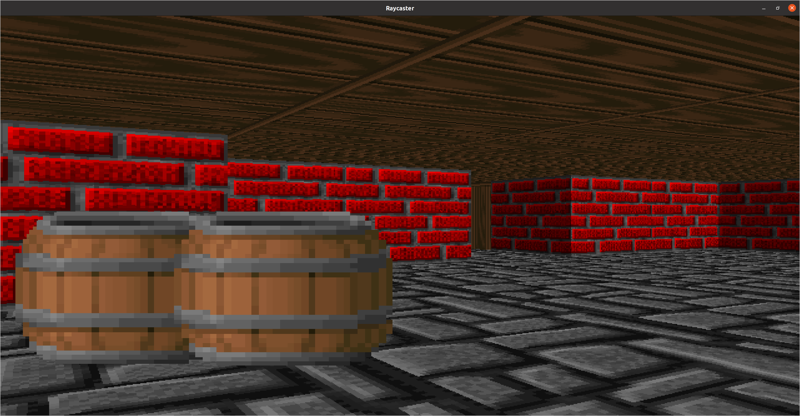

# Wolf-Rust

Just a simple ray-caster engine build in the Rust programming langauge that I programmed to mess around with ray-casting algorithms.

I'm interested in adding more levels, a HUD, and sound at some point in time

It uses [SDL2](https://github.com/Rust-SDL2/rust-sdl2), so if you are having problems compiling the code, I would look there

## Screenshots

 